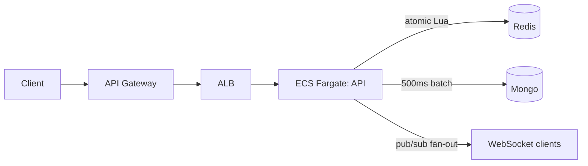

# GymJam

Real-time social music platform for gyms — members vote on tracks live and the
queue reorders by community votes. **This repo is the engineering core**:
containerized services, a race-free real-time voting layer, AWS infrastructure as
code, and CI/CD.

> The full product vision (Spotify playback, ML re-ranker, owner dashboard) lives
> in [`GymJam-README.md`](./GymJam-README.md). This repo implements the backend,
> infra, and pipeline that back it.

## Quickstart (local, ~2 min)

```bash
docker compose up --build         # api + redis + mongo
node server/test/concurrency.js   # proves the voting invariants
```

Expected output:

```
✓ 50 concurrent upvotes -> tally is exactly 50 (no lost updates)
✓ 20 switch to down -> tally is exactly 10 (switch handled atomically)
✓ 10 retries of one action -> counted once (idempotent)
```

## What this demonstrates

**1 · Containerized microservices on AWS Fargate, provisioned via Terraform + CI/CD.**
The API ships as a Docker image to ECR and runs on ECS Fargate behind an ALB and an
API Gateway HTTP API. All infra is in `infra/terraform/`; `terraform apply` brings
up the whole stack. GitHub Actions does rolling, zero-downtime deploys on merge.

**2 · A real-time vote layer that stays correct under contention.**
50 people voting in the same instant don't lose updates, retries don't double-count,
and vote switches are handled atomically — see `server/src/vote.lua` and the passing
`server/test/concurrency.js`.

**3 · Observability and reliable rollouts.**
Container logs stream to CloudWatch; the ALB target group health-checks `/healthz`;
the ECS deployment config keeps the old task serving until the new one is healthy.

## How the vote layer works

- **Race-free tallies.** Each vote runs an atomic Redis Lua script. Redis is
  single-threaded, so the read-modify-write on the tally can't interleave — no
  locks, no lost updates. (`server/src/vote.lua`)
- **Idempotent writes.** Every user action carries an `Idempotency-Key`. A network
  retry reuses the key (counted once); a genuine vote change is a new key. (`votes.js`)
- **Hot path vs durable store.** Redis holds the live tallies; Mongo is the durable
  copy, written via a batched 500ms flush — keeps Mongo off the burst path. (`votes.js`)
- **Horizontal scale.** The WebSocket gateway fans out via Redis pub/sub, so any
  task can serve any client — no sticky sessions. (`index.js`)



## Playback (YouTube)

The top-voted track auto-plays on a designated **floor screen**. Open the app, hit
**Play on this screen**, and that device becomes the speaker: it plays the #1 track
and, when each song ends, drops it and rolls to the next highest-voted one. Phones
in the room just vote and add — they show what's on air without blasting audio.

- **Anyone can add a song** by pasting a YouTube link (full URL, `youtu.be`, or
  `/shorts`). The title is resolved server-side via YouTube oEmbed — no API key.
- **Type-to-search** is optional: set `YOUTUBE_API_KEY` (Data API v3) to let members
  search instead of paste. `GET /api/config` tells the UI which mode is on.
- The ranked queue is kept in a Redis sorted set updated **inside the same atomic
  Lua script** as the tally, so the order the floor plays from is as race-free as
  the counts. Proof: `node server/test/jukebox.mjs`.

```
GET  /api/gyms/:gym/state            # now-playing + queue ranked by votes
POST /api/gyms/:gym/tracks           # { url | videoId } — add a song
POST /api/gyms/:gym/advance          # { finishedId } — floor reports song ended
GET  /api/youtube/search?q=          # optional, needs YOUTUBE_API_KEY
```

## Deploy to AWS

See [`infra/terraform/README.md`](./infra/terraform/README.md) for the
apply → screenshot → destroy runbook (kept cheap on purpose). The stack: ECR, ECS
Fargate, ALB with a `/healthz` target-group probe, API Gateway (HTTP API via VPC
Link), CloudWatch log group, and a least-privilege task execution role.

## CI/CD

- `.github/workflows/ci.yml` — on PRs: spins up ephemeral Redis + Mongo, boots the
  API, and runs the concurrency/idempotency suite.
- `.github/workflows/deploy.yml` — on merge to `main`: builds, pushes to ECR, and
  runs a rolling ECS deploy that waits for service stability.

## Repo layout

```
GymJam/
├── server/                 # Node API + WebSocket + atomic vote layer
│   ├── src/vote.lua        # the race-free core
│   ├── src/votes.js        # castVote + batched Mongo flush
│   └── test/concurrency.js # proves the invariants
├── infra/terraform/        # ECR, ECS Fargate, ALB, API Gateway, CloudWatch
├── .github/workflows/      # CI (PRs) + rolling deploy (main)
└── docker-compose.yml      # local stack
```

## Demo vs production (honest scope)

For a cheap portfolio bring-up, Redis and Mongo run as sidecar containers in the
Fargate task and the stack uses the default VPC's public subnets. Production swaps
the sidecars for ElastiCache + MongoDB Atlas (same env vars) and moves tasks into
private subnets behind NAT. The ML re-ranker is roadmap. Playback is built here via YouTube (see below).

## License

MIT
