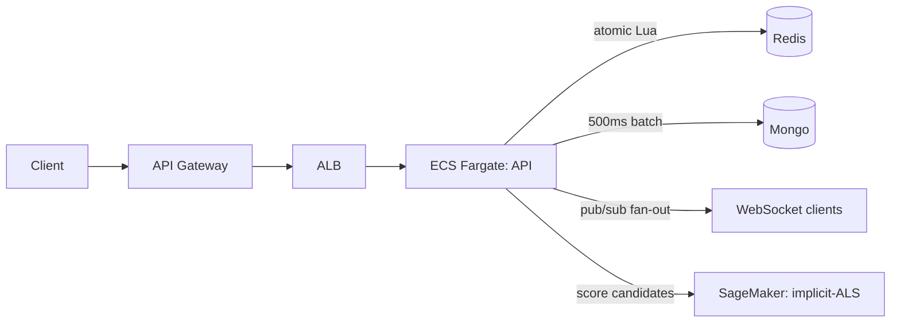

# GymJam

Real-time social music platform for gyms — members vote on tracks live and the
queue reorders by community votes. **This repo is the engineering core**:
containerized services, a race-free real-time voting layer, AWS infrastructure as
code, CI/CD, and an offline-trained ML recommender used as a re-ranking signal.

## Quickstart (local, ~2 min)

```bash
docker compose up --build           # api + redis + mongo + recommender
node server/test/concurrency.js     # proves the voting invariants
node server/test/recommender.js     # proves the recommender client invariants
```

Expected concurrency output:

```
✓ 50 concurrent upvotes -> tally is exactly 50 (no lost updates)
✓ 20 switch to down -> tally is exactly 10 (switch handled atomically)
✓ 10 retries of one action -> counted once (idempotent)
```

## What this demonstrates

**1 · Containerized microservices on AWS Fargate, provisioned via Terraform + CI/CD.**
The API ships as a Docker image to ECR and runs on ECS Fargate behind an ALB and an
API Gateway HTTP API. All infra is in `infra/terraform/`; `terraform apply` brings
up the whole stack. GitHub Actions does rolling, zero-downtime deploys on merge.

**2 · A real-time vote layer that stays correct under contention.**
50 people voting in the same instant don't lose updates, retries don't double-count,
and vote switches are handled atomically — see `server/src/vote.lua` and the passing
`server/test/concurrency.js`.

**3 · Observability and reliable rollouts.**
Container logs stream to CloudWatch; the ALB target group health-checks `/healthz`;
the ECS deployment config keeps the old task serving until the new one is healthy.

**4 · ML recommender (implicit-ALS) deployed on SageMaker, surfaced as a re-ranking signal.**
Offline-trained collaborative filtering with leave-one-out Recall@10 evaluation;
shipped as a BYOC container and consumed by the API to bias the seed pool per gym
and break ties in the queue. Votes stay primary — the model never overrides them.

## How the vote layer works

- **Race-free tallies.** Each vote runs an atomic Redis Lua script. Redis is
  single-threaded, so the read-modify-write on the tally can't interleave — no
  locks, no lost updates. (`server/src/vote.lua`)
- **Idempotent writes.** Every user action carries an `Idempotency-Key`. A network
  retry reuses the key (counted once); a genuine vote change is a new key. (`votes.js`)
- **Hot path vs durable store.** Redis holds the live tallies; Mongo is the durable
  copy, written via a batched 500ms flush — keeps Mongo off the burst path. (`votes.js`)
- **Horizontal scale.** The WebSocket gateway fans out via Redis pub/sub, so any
  task can serve any client — no sticky sessions. (`index.js`)



## Playback (YouTube)

The top-voted track auto-plays on a designated **floor screen**. Open the app, hit
**Play on this screen**, and that device becomes the speaker: it plays the #1 track
and, when each song ends, drops it and rolls to the next highest-voted one. Phones
in the room just vote and add — they show what's on air without blasting audio.

- **Anyone can add a song** by pasting a YouTube link (full URL, `youtu.be`, or
  `/shorts`). The title is resolved server-side via YouTube oEmbed — no API key.
- **Type-to-search** is optional: set `YOUTUBE_API_KEY` (Data API v3) to let members
  search instead of paste. `GET /api/config` tells the UI which mode is on.
- The ranked queue is kept in a Redis sorted set updated **inside the same atomic
  Lua script** as the tally, so the order the floor plays from is as race-free as
  the counts. Proof: `node server/test/jukebox.mjs`.

```
GET  /api/gyms/:gym/state            # now-playing + queue ranked by votes
POST /api/gyms/:gym/tracks           # { url | videoId } — add a song
POST /api/gyms/:gym/advance          # { finishedId } — floor reports song ended
GET  /api/youtube/search?q=          # optional, needs YOUTUBE_API_KEY
```

## Joining the floor — QR code & URL override

The floor screen shows a QR code that phones in the room scan to join. Getting
the right URL into that QR is fiddly when the API runs inside Docker: from
inside the container, `os.networkInterfaces()` only sees the Docker bridge IP
(e.g. `172.20.0.4`), which **isn't reachable from phones**.

GymJam resolves the join URL in this priority order:

1. **Per-gym URL the operator typed into the UI** (stored in Redis). The floor
   screen has an **Edit** button next to the QR — paste `http://192.168.1.45:3000`
   and the QR regenerates against that. Your URL beats anything we auto-detect.
2. `PUBLIC_URL` env var (deploy-time override for ALB/API Gateway).
3. The Host header the screen used — *only if* it's reachable from a phone
   (i.e. not localhost and not a 172.16/12 Docker bridge address).
4. OS-detected LAN IP, with Docker bridge ranges (172.16–31, 169.254 link-local)
   explicitly excluded so we never hand a phone an internal IP.
5. `localhost` (last resort).

```
GET    /api/gyms/:gym/join          # { url, lan, override }   — what the QR encodes
GET    /api/gyms/:gym/qr.svg        # the QR itself
PUT    /api/gyms/:gym/public-url    # { url } — operator override (top priority)
DELETE /api/gyms/:gym/public-url    # clears the override
```

## ML recommender (Step 4)

[`ml/`](./ml) contains the full pipeline: data, training, evaluation, serving,
and SageMaker deploy.

- **Model.** Implicit ALS (Hu, Koren, Volinsky 2008) on upvote interactions.
  Trained offline on member→track positives. Downvotes are deliberately not
  fed in as negatives — that would suppress polarizing-but-popular songs.
- **Evaluation.** Leave-one-out Recall@10 on the held-out positive per member,
  reported against the random-recall baseline `K/N`. On the bundled synthetic
  data (200×50, cluster-structured) it lands ~0.55 vs the 0.20 baseline.
- **Serving.** Flask app speaking the SageMaker `/ping` + `/invocations`
  contract; same image runs locally (`docker compose up`) and on SageMaker.
- **Re-ranking signal — votes stay primary.** Two integration points:
  1. `autofill()` ranks unused seeds by recommender score before picking.
     Different rooms diverge from day one.
  2. `getState()` sorts the queue by `(tally, recScore)`. A +1 tally always
     beats a 0, regardless of rec. The rec score only breaks ties.
- **Fail-closed.** A `1.5s` timeout, a 3-strike circuit breaker (60s cooldown)
  per `RECOMMENDER_TIMEOUT_MS` / `RECOMMENDER_URL`, and a 30s per-gym Redis
  cache so `getState` never blocks on a model call. If the endpoint is
  unreachable the room runs exactly like Step 3 (vote-only, shuffled seeds).

```
GET  /api/gyms/:gym/recommend?n=10   # top-N picks for this gym (debug / inspect)
```

Train & serve locally:

```bash
cd ml
pip install -r requirements.txt
python train.py --out ./artifact     # prints Recall@10 vs random baseline
MODEL_DIR=./artifact python serve.py # localhost:8080
```

Deploy on SageMaker via [`infra/terraform/ml.tf`](./infra/terraform/ml.tf)
(gated behind `var.enable_ml=false` by default — endpoints are billed hourly):

```bash
cd infra/terraform
terraform apply -var enable_ml=true -var ml_image_uri=<your-ecr-image>
# screenshot, then immediately:
terraform apply -var enable_ml=false   # tears down ML, leaves API stack up
```

## Deploy to AWS

See [`infra/terraform/README.md`](./infra/terraform/README.md) for the
apply → screenshot → destroy runbook (kept cheap on purpose). The stack: ECR, ECS
Fargate, ALB with a `/healthz` target-group probe, API Gateway (HTTP API via VPC
Link), CloudWatch log group, and a least-privilege task execution role. Step 4
adds an optional SageMaker endpoint (off by default).

## CI/CD

- `.github/workflows/ci.yml` — on PRs: spins up ephemeral Redis + Mongo, boots the
  API, and runs the concurrency/idempotency suite + recommender smoke test.
- `.github/workflows/deploy.yml` — on merge to `main`: builds, pushes to ECR, and
  runs a rolling ECS deploy that waits for service stability.

## Repo layout

```
GymJam/
├── server/                 # Node API + WebSocket + atomic vote layer
│   ├── src/vote.lua        # the race-free core
│   ├── src/votes.js        # castVote + batched Mongo flush + re-ranker hook
│   ├── src/recommender.js  # SageMaker client (timeout + circuit breaker)
│   ├── test/concurrency.js # proves the voting invariants
│   └── test/recommender.js # proves the recommender client invariants
├── ml/                     # implicit-ALS pipeline + SageMaker BYOC container
├── infra/terraform/        # ECR, ECS Fargate, ALB, API Gateway, CloudWatch,
│                           #   SageMaker (off by default)
├── .github/workflows/      # CI (PRs) + rolling deploy (main)
└── docker-compose.yml      # local stack (api + redis + mongo + recommender)
```

## Demo vs production (honest scope)

For a cheap portfolio bring-up, Redis and Mongo run as sidecar containers in the
Fargate task and the stack uses the default VPC's public subnets. Production swaps
the sidecars for ElastiCache + MongoDB Atlas (same env vars) and moves tasks into
private subnets behind NAT. The SageMaker endpoint is off by default; flip
`enable_ml=true` to demo it, screenshot, flip back to destroy. Playback runs on
YouTube.

## License

MIT
